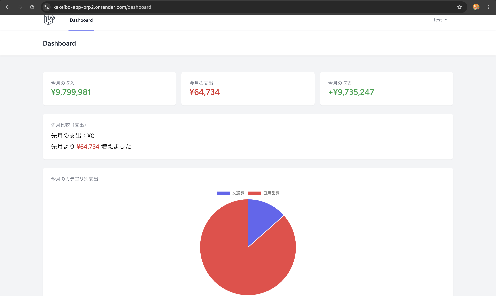
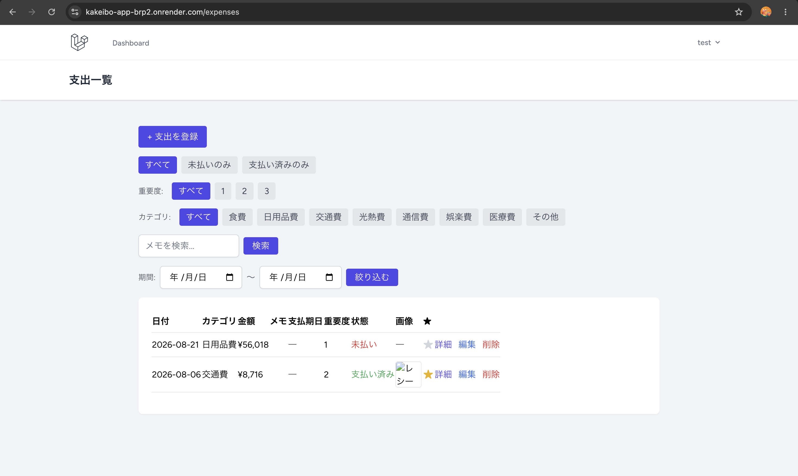
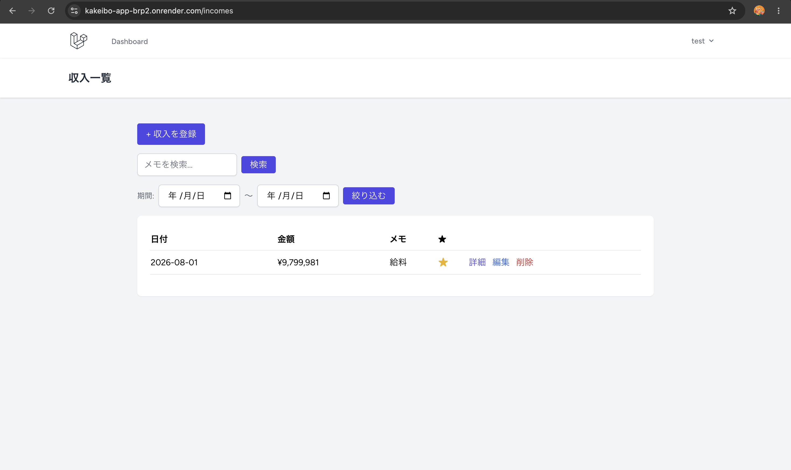

# 主婦家計簿アプリ
**公開URL:** https://kakeibo-app-brp2.onrender.com

## 概要
忙しい主婦が家計を簡単に管理できるWebアプリケーションです。
支出・収入の記録、カテゴリ別の収支管理、検索・フィルタリング、月次レポートの確認ができます。

## 機能一覧
- ユーザー登録・ログイン
- 支出・収入の手動入力（金額・カテゴリ・日付・メモ）
- 支出の拡張管理（支払期日・重要度・支払い済みフラグ）
- カテゴリ別の収支管理
- 検索・フィルタリング（支払い状況・重要度・カテゴリ・キーワード・期間、複数条件の組み合わせ対応）
- お気に入り機能（Ajaxによる登録・解除）
- レシート画像アップロード（手動、非公開ディスクによるアクセス制限あり）
- 月次レポート・グラフ表示（今月の収支サマリー・先月比較・カテゴリ別円グラフ）

## 今後実装予定の機能（Should要件）
- レシート撮影による自動入力（OCR）
- 節約目標の設定と達成率確認
- 家族グループでの共有

## ⚠️ 現在わかっている問題
- **レシート画像がしばらくすると消える**：レシート画像は、今はサーバーの中に直接保存する形にしている。ただRenderの無料プランでは、コードを更新して再デプロイするたびに、サーバーの中身がリセットされてしまうため、それまでにアップロードした画像も一緒に消えてしまう（データの記録自体は残るが、画像だけ表示できなくなる）。
  今回はAWSアカウントを持っているものの、設定作業に時間がかかることと、今回のゴール（デプロイ完了・成果物共有）を優先したかったことから、対応は見送り。将来的には、AWS S3のような「サーバーの外に画像を保存できる場所」と連携させることで解決できる見込み。

## 技術スタック
- **バックエンド**: PHP 8.4 / Laravel 13.x
- **フロントエンド**: Blade / Tailwind CSS / Alpine.js
- **データベース**: MySQL 8.0（開発環境） / PostgreSQL（本番環境・Render）
- **インフラ**: Docker / Render / AWS S3
- **開発ツール**: Git / GitHub / Claude Code

## 開発環境の起動方法

```bash
# コンテナ起動(PHP + Nginx + MySQL)
docker compose up -d --build

# 依存パッケージのインストール
npm install

# CSS/JSのビルド
npm run build

# マイグレーション実行
docker compose exec app php artisan migrate

# カテゴリの初期データ投入
docker compose exec app php artisan db:seed --class=CategorySeeder
```

ブラウザで `http://localhost:8000` にアクセス。

### 補足：CSS/JSのビルドについて

`npm run build`で生成される`public/build`配下のファイルは、通常`.gitignore`で除外される。
ただし本番環境（Render）ではNode.jsを使ったビルド工程を用意していないため、
ローカルでビルドした成果物を`-f`オプションで明示的にGit管理に含めている。

そのため、CSS/JSに関わる変更（Tailwind CSSの新しいクラスの追加など）を行った場合は、
以下の手順で本番用ファイルも更新する必要がある。

```bash
npm run build
git add public/build/ -f
git commit -m "..."
git push
```

## 📸 スクリーンショット

### ダッシュボード
今月の収支サマリー・先月比較・カテゴリ別支出のグラフを表示。


### 支出一覧
支払い状況・重要度・カテゴリ・キーワード・期間で絞り込みが可能。レシート画像はサムネイル表示。


### 収入一覧
支出一覧と同様に、検索・お気に入り機能に対応。


## ドキュメント
- [要件定義書](docs/requirements.md)
- [DB設計書](docs/db_design.md)
- [API仕様書](docs/api_spec.md)
- [技術選定資料](docs/tech_stack.md)
- [スケジュール・工数見積もり](docs/schedule.md)
- [画面設計（Figma）](https://www.figma.com/design/JOdmdd5Iz91CSVUgHhGaZY/%E4%B8%BB%E5%A9%A6%E5%AE%B6%E8%A8%88%E7%B0%BF_%E8%A8%AD%E8%A8%88?node-id=0-1&t=W0q84b4iKbLLlxZn-1)

## 開発期間
- Week21: 企画・設計
- Week22: 環境構築・認証・基本CRUD
- Week23: 全機能実装・UI
- Week24: デプロイ・仕上げ

## Week22 課題 - 実装スキル①（環境構築・認証・基本CRUD）

### 概要
Week21で作成した企画・設計書をもとに、総合プロジェクトの実装フェーズを開始した。開発環境の構築から認証機能、基本CRUD（Create・Read）までを実装し、実践的なLaravel開発フローを体験しながらプロダクトの基盤を構築した。

### 実装内容
- 環境構築
  - Laravelプロジェクトをセットアップ（PHP 8.4 / Laravel 13.x）
  - Docker環境を構築（PHP-FPM + Nginx + MySQL 8.0の3コンテナ構成）
  - MySQL接続設定・マイグレーション動作確認
- 認証機能
  - Laravel Breezeを導入し、新規登録・ログイン・ログアウト機能を実装
- 基本CRUD（支出・収入）
  - DB設計書に基づき categories・expenses・incomes テーブルを作成
  - モデルにリレーション（User⇔Expense⇔Category など）を定義
  - 支出・収入それぞれのCreate・Read機能を実装（一覧・新規登録・詳細画面）
  - FormRequestによるバリデーション（金額必須、日付必須など）を実装
  - カテゴリはSeederで初期データ（食費・日用品費など8種類）を投入
- セキュリティ対応
  - ログインユーザー本人のデータのみアクセス可能に制限（他人のデータへの直接アクセスは403エラー）
  - Mass Assignment対策として$fillableを明示
- Git/GitHub運用
  - week22/setup-auth-crud ブランチで作業し、随時コミット・プッシュ

### 今後追加予定
- 画像アップロード機能（レシート）
- Update・Delete機能
- 節約目標（goals）・家族グループ共有機能
- 月次レポート・グラフ表示
- Week23〜24で残りの機能実装・UI調整・デプロイを行う

## Week23 課題 - 実装スキル②（CRUD完成・検索・画像アップロード・ダッシュボード）

### 概要
Week22で構築した基盤（認証・基本CRUD）をもとに、支出・収入のUpdate・Delete機能、検索・フィルタリング、レシート画像アップロード、月別収支ダッシュボードまでを実装し、要件定義書のMust要件（MVP）をすべて満たすところまでプロダクトを仕上げた。

### 実装内容

#### CRUD完成（Update・Delete）
- 支出（expenses）・収入（incomes）双方にedit・update・destroyを実装
- LaravelのPolicy（ExpensePolicy・IncomePolicy）を導入し、本人のデータ以外は編集・削除できないよう権限管理を一元化
- チェックボックス項目（支払い済みフラグ）が未送信時にfalseとして扱われない問題に対応（`$request->has()`で明示的に判定）

#### 支出管理の拡張項目
- `due_date`（支払期日）・`priority`（重要度1〜3）・`is_paid`（支払い済みフラグ）をexpensesテーブルに追加
- 一覧・詳細・登録・編集の全画面に反映し、支払い予定の管理ができるように

#### 検索・フィルタリング機能
- 支払い状況（未払い／支払い済み）
- 重要度（1〜3）
- カテゴリ
- キーワード検索（メモの部分一致）
- 期間（開始日〜終了日）
- 上記5種類のフィルタを複数同時に組み合わせ可能（`request()->except()`を活用し、条件を保持したままURLを生成）
- ページネーションと組み合わせても検索条件が維持されるよう`withQueryString()`を使用

#### レシート画像アップロード機能
- `receipt_image`カラムを追加し、支出データに画像を添付可能に
- 新規登録・編集・削除それぞれで画像の保存／差し替え／削除処理を実装
- 一覧画面にサムネイル表示、詳細・編集画面にプレビュー表示を追加
- **セキュリティ対応**：画像を公開ディスク（public）ではなく非公開ディスク（local）に保存し、専用ルート＋Policyによる本人確認を経由してのみ画像を取得できる仕組みに変更（URLを知っていても第三者はアクセス不可）
- Nginx（`client_max_body_size`）・PHP（`upload_max_filesize`／`post_max_size`）双方のアップロード上限を調整し、スマホ撮影サイズの画像にも対応

#### ダッシュボード（月別収支・グラフ）
- 今月の収入・支出・収支サマリーを表示
- 先月との支出比較（増減額を自動計算）
- カテゴリ別支出の円グラフ表示（Chart.jsを導入）
- `DashboardController`を新設し、クロージャで実装されていたdashboardルートをController経由に変更

#### パフォーマンス最適化
- 一覧表示時のEager Loading（`with('category')`）でN+1問題を回避
- 日付カラムに`$casts`を設定し、Carbonインスタンスとして統一的に扱えるように整理

### セキュリティ対応
- 全CRUD操作にPolicyによる権限チェックを追加（本人以外は403）
- レシート画像も本人以外はアクセス不可（要件定義書のセキュリティ要件に対応）
- FormRequestによるバリデーションを更新系にも整備（UpdateExpenseRequest・UpdateIncomeRequest）

### Git/GitHub運用
- `week23/expense-update-delete`ブランチで作業を継続
- 機能単位でこまめにコミット

### 今後追加予定（Week24）
- 本番環境へのデプロイ
- 節約目標（goals）・家族グループ共有機能
- レシート画像のOCR自動読み取り（Should要件）
- PHPUnitによる自動テストの追加
- README・プレゼン資料の最終仕上げ

## Week23 講師添削対応（お気に入り機能・N+1再修正・コンポーネント化）

### 概要
Week23本編（PR #14）に対して講師から3回にわたる添削があり、すべて対応した（`week23/review-fixes`ブランチ、PR #15）。単なる指摘対応にとどまらず、ポリモーフィックリレーションやBladeコンポーネント設計など、新しい技術要素を実践的に学ぶ機会になった。

### 1回目の添削対応（5点）

#### お気に入り機能の実装（多態的リレーション）
- `favorites`テーブルを新設し、`favoritable_type`・`favoritable_id`カラムによる多態的リレーション（morphToMany）を採用
- 1つのテーブルで支出・収入どちらのお気に入りにも対応できる設計に
- `FavoriteController`でAjax（fetch）による切り替えを実装し、画面遷移なしでお気に入り登録・解除が可能に

#### 収入側への検索・フィルタ追加
- Week23本編では支出（expenses）のみだった検索・フィルタ機能を、収入（incomes）一覧にも追加

#### Bladeコンポーネント化
- 支出・収入で重複していたフィルタUIやテーブル行を、`x-favorite-button`・`x-search-form`・`x-date-range-filter`としてコンポーネント化
- 支出・収入の両方から共通利用できるように整理し、コードの重複を解消

#### レスポンシブ対応（横スクロール）
- 支出一覧テーブルがスマホ表示で崩れていた問題を、`overflow-x-auto` + `min-w-max`で解決

#### コミット粒度の改善
- Week23本編は1コミットにまとまっていたが、以降は機能単位でコミットを分割するよう改善

### 2回目の添削対応（N+1再発・コンポーネント未徹底）

#### N+1問題の再修正
- お気に入り一覧取得時に`favoritedByUsers`がEager Loadingされておらず、N+1問題が再発
- `with(['category', 'favoritedByUsers'])`と複数リレーションをまとめて事前取得するよう修正

#### テーブル行の完全コンポーネント化
- `<tr>`部分がまだベタ書きのまま重複していたため、`x-expense-row`・`x-income-row`として切り出し
- `<tbody>`内は`@foreach`でコンポーネントを呼び出すだけのシンプルな構造に整理

### 3回目の添削対応（最終確認）

- N+1問題については、2回目の対応時点（コミット`3e6adfe`）ですでに解決済みであることを確認し、追加対応は不要と判断
- 収入一覧のスマホ横スクロール対応が未実装だったため、支出一覧と同じ`overflow-x-auto` + `min-w-max`を追加

### 学んだこと
- **多態的リレーション（ポリモーフィックリレーション）**：1つの中間テーブルで複数モデルへのリレーションを表現する設計手法
- **Bladeの匿名コンポーネント**：`resources/views/components/`に置くだけで`<x-コンポーネント名>`として呼び出せる、再利用性の高い実装方法
- **Eager Loadingの追加漏れへの注意**：新しいリレーションを画面で使うたびに、既存の`with()`に追加できているか確認する習慣の重要性
- **コンポーネント分割の判断基準**：「内容が完全に共通か」で判断し、支出・収入で列数や内容が異なる部分は無理に1つにまとめず、別々のコンポーネントに分けた

## Week24 課題 - 仕上げ・本番デプロイ・6ヶ月間の総括

### 概要
最終週として、バグ修正・セキュリティチェックによる品質確認、Renderへの本番環境デプロイ、READMEの最終仕上げを行った。特にデプロイ作業では、ローカル開発環境と本番環境の違いに起因する複数のトラブルに直面し、1つずつ原因を切り分けながら解決する実践的な経験を積んだ。

### バグ修正・品質確認（Day1-3）

要件定義書のバグ修正チェックリストに沿って、以下を確認・修正した。

#### 権限チェックの確認
- 支出・収入それぞれの編集・詳細画面に対して、他人のデータのURLを直接叩いた場合に403エラーとなることを確認
- お気に入り機能についても、開発者ツールでAjaxリクエストを再現し、他人のデータに対するお気に入り登録が403でブロックされることを確認

#### バリデーションエラーメッセージの日本語化
- `.env`の`APP_LOCALE`が英語（`en`）のままだったため、バリデーションエラーが英語表示になっていた問題を発見
- `php artisan lang:publish`で言語ファイルを生成し、`lang/ja/validation.php`を作成
- 実際に使用しているバリデーションルール（required・min・between等）と、フォーム項目名を日本語化

#### 画像アップロードの多角的テスト
- 正常な画像のアップロード・表示
- 画像以外のファイル（偽装ファイル）が拡張子ではなく実際の中身で判定され、弾かれることを確認
- 5MBを超えるファイルが日本語エラーメッセージとともに弾かれることを確認（Nginx側の10MB制限との多重防御も確認）
- レシート画像のURLを直接指定しても、他人の画像は403で保護されることを確認

#### 検索・フィルタの動作確認
- キーワード検索単体、複数条件の組み合わせ（AND条件）、該当データが0件の場合の表示崩れがないことを確認

### 本番環境デプロイ（Day4-5）

#### インフラ構成
- **ホスティング**: Render（無料プラン）
- **データベース**: Render PostgreSQL（無料プラン）
- 本番環境はPostgreSQL、ローカル開発環境はMySQLという構成のため、両方に対応できるようDockerfileを調整

#### デプロイ時に発生した問題と解決（トラブルシューティング記録）

デプロイ作業を通じて、ローカル開発環境（Docker Compose）と本番環境（Render）の違いに起因する、以下のような問題に直面し、1つずつ解決した。

1. **Dockerfileの本番未対応**
   - 元々のDockerfileはPHP-FPMを起動するのみで、アプリコードのコピーや依存パッケージのインストールが含まれていなかった
   - `COPY . .`と`composer install`を追加し、PostgreSQL接続用の`pdo_pgsql`拡張機能も追加

2. **php-fpmだけでは直接アクセスに応答できない問題**
   - ローカルはNginx経由でPHP-FPMと通信する構成だが、Render上では単体のコンテナが直接HTTPリクエストに応答する必要がある
   - Dockerfile自体はローカル用（`CMD ["php-fpm"]`）のまま残し、Render側の「Docker Command」設定で起動コマンドを上書きする方法を採用

3. **storage/frameworkディレクトリのGit管理漏れ**
   - `.gitignore`でキャッシュファイルを除外する設定はあったが、フォルダの存在を保つための`.gitignore`ファイル自体が各フォルダに作成されていなかった
   - ローカルでは実際にフォルダが存在するため問題が表面化せず、GitHub経由でコードを取得するRenderでのみ発生した（`Please provide a valid cache path`エラー）
   - `storage/framework/{cache,sessions,testing,views}`それぞれに`.gitignore`を追加し、フォルダ構造自体はGit管理下に含めるよう修正

4. **マイグレーション未実行によるセッションエラー**
   - Renderの無料プランではShellやOne-Off Jobsが使えず、通常の方法でマイグレーションを実行できない
   - コンテナ起動時に自動でマイグレーションを実行する`docker-entrypoint.sh`を作成し、`php artisan migrate --force`の後にサーバーを起動する構成に変更

5. **Vite manifest not foundエラー**
   - ログイン画面などTailwind CSSを使う画面で、ビルド済みのCSS/JSファイルが本番環境に存在せずエラーに
   - `.gitignore`で除外されていた`public/build`をローカルでビルドした上で`-f`オプションを使って明示的にGit管理に含めることで解決

6. **Mixed Content（HTTPS）エラー**
   - RenderはHTTPS経由でアクセスされるが、Laravel側は内部的にHTTPと誤認識し、CSSやJSをHTTPで読み込もうとしてブラウザにブロックされる問題が発生
   - 環境変数`APP_URL`をHTTPSのURLで明示的に設定することで解決

7. **Mixed Contentエラーの根本対応（`APP_URL`だけでは不十分だった）**
   - `APP_URL`をHTTPSで設定した後も、ログイン画面など一部の画面でMixed Contentエラーが再発
   - Renderのようなリバースプロキシ環境では、外部との通信はHTTPSでも、内部でコンテナへ転送される際にはHTTPになっており、Laravelがそれを見て「今の通信はHTTPだ」と誤判定してしまうことが原因と判明
   - `AppServiceProvider`の`boot()`メソッドに`URL::forceScheme('https')`を追加し、本番環境では常にHTTPSのURLを生成するよう強制することで解決

8. **カテゴリの初期データが本番環境に投入されていない**
   - マイグレーション（テーブル作成）は自動化していたが、カテゴリの初期データ（食費・日用品費など）を投入するSeederは本番環境で一度も実行されておらず、支出・収入登録時にカテゴリが選択できない状態になっていた
   - `CategorySeeder`は`firstOrCreate`を使っており、何度実行しても重複登録されない安全な作りだったため、`docker-entrypoint.sh`に`php artisan db:seed --class=CategorySeeder --force`を追加し、起動のたびに自動実行されるよう変更

### README・成果物共有（Day6-7）
- READMEにWeek24の作業内容を追記し、最終仕上げを実施
- 公開URL・GitHubリポジトリ・動作確認済み機能一覧・6ヶ月間の振り返りを講師に共有

### 学んだこと
- **ローカルと本番環境の違い**：「ローカルで動く」ことと「本番で動く」ことは別問題であり、Gitに何が実際にコミットされているか、環境変数がどう設定されているかを1つずつ確認する重要性を実感した
- **ログを読んで仮説を立てる力**：500エラーが出るたびに、Renderのログから実際のエラーメッセージを特定し、原因を1つずつ切り分けていくデバッグの基本的な進め方を実践できた
- **セキュリティ設定の意味を体感**：`APP_DEBUG=false`が有効な状態でエラー画面を見たとき、詳細な情報が一切表示されないことを実際に確認し、この設定の重要性を実感した


## 💡 工夫した点

1. **セキュリティ対策**
   - 全CRUD操作にPolicyを適用し、本人以外のデータへのアクセスを403で遮断
   - レシート画像は非公開ディスクに保存し、専用ルート＋Policyを経由してのみ表示可能に
   - `.env`のGit非混入、`APP_DEBUG=false`など、本番環境向けのセキュリティ設定を徹底

2. **パフォーマンス最適化**
   - Eager Loading（`with()`）でN+1問題を回避。講師添削で再発した際も、原因を特定して再修正
   - ページネーションと検索条件を`withQueryString()`で両立

3. **UI/UX**
   - Tailwind CSSでモダンなデザイン、Alpine.jsでお気に入り機能などのスムーズな操作感を実現
   - レスポンシブ対応（`overflow-x-auto` + `min-w-max`によるスマホでの横スクロール対応）
   - バリデーションエラーメッセージの日本語化により、実際の利用者（主婦層）にとって使いやすい表示に

4. **コード品質**
   - Policyによる権限管理の一元化
   - FormRequestによるバリデーションの分離
   - Bladeコンポーネント化（`x-favorite-button`・`x-expense-row`など）による重複コードの解消

5. **本番運用への意識**
   - ローカルと本番の違い（Docker構成・DB種類・HTTPS判定など）を1つずつ検証し、両環境で動作する構成に調整
   - `docker-entrypoint.sh`で、マイグレーションとカテゴリ初期データ投入を起動時に自動実行

## 👤 作成者

- GitHub: [@misaki36](https://github.com/misaki36)

## 📄 ライセンス

このプロジェクトは学習目的で作成されたものです。
